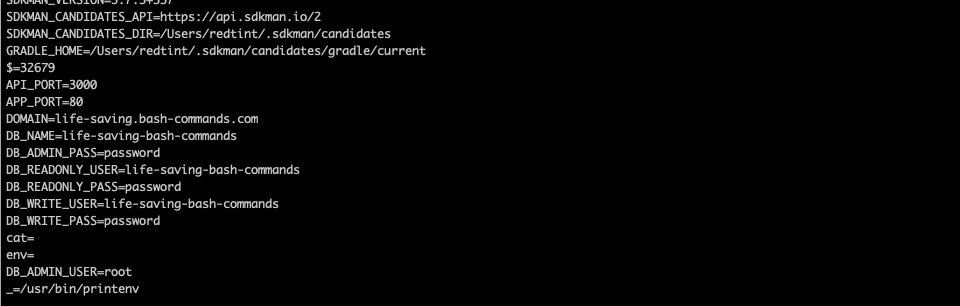

# Life Saving Bash Commands
This repository contains some of the useful and life saving bash commands I have used through the years. Feel free to **star** as this will be updated when I use another bash command and feel that it should be included in this list. :)

## 1. Current Directory Size
**Purpose:** So, you wanted to clean up? This command is useful for showing your current folder's list of directories and their sizes.

**Command:**
```
du -sch ./*
```

**Output:**
```
$ du -sch ./*
 32M	./AndroidStudioProjects
249M	./Applications
3.3M	./Creative Cloud Files
216M	./Desktop
3.5G	./Documents
5.9G	./Downloads
```

## 2. Finding Nested Files
**Purpose:** Simply search for a file by replacing `<filename>`. `file` traverse through all directories starting from your current directory. BONUS: You can even use wildcards to do some matching.

**Command:**
```
find . -name <filename>

# e.g: 
find . -name "Screen*"
find . -name "my-long-lost-dog.jpg"
```

**Output:**
```
~/Desktop 14:44:24
$ find . -name "Screen*"
./Screen Shot 2020-05-02 at 7.57.36 PM.png
./Screen Shot 2020-04-28 at 7.01.36 PM.png
./Screen Shot 2020-04-14 at 3.18.24 PM.png
./Screen Shot 2020-04-17 at 7.08.00 PM.png
./Screen Shot 2020-04-15 at 7.51.19 PM.png
./Screen Shot 2020-04-23 at 7.14.19 PM.png
./Screen Shot 2020-04-17 at 6.28.06 PM.png
./Screen Shot 2020-04-22 at 6.18.13 PM.png
./Screen Shot 2020-04-23 at 3.50.45 PM.png
./Screen Shot 2020-04-17 at 6.38.21 PM.png
./Screen Shot 2020-05-02 at 6.52.17 PM.png
./Screen Shot 2020-04-14 at 3.10.52 PM.png
./Screen Shot 2020-04-17 at 7.04.43 PM.png
./Screen Shot 2020-04-14 at 3.32.55 PM.png
./Screen Shot 2020-04-23 at 6.41.29 PM (2).png
./Screen Shot 2020-04-29 at 4.03.06 PM.png
./Screen Shot 2020-04-29 at 5.42.56 PM.png
./Screen Shot 2020-05-02 at 2.12.02 AM.png
./Screen Shot 2020-04-14 at 1.50.35 PM.png
./Screen Shot 2020-05-03 at 12.21.12 AM.png
./Screen Shot 2020-04-22 at 6.19.23 PM.png
./Screen Shot 2020-04-17 at 5.43.51 PM.png
./Screen Shot 2020-04-23 at 3.42.12 PM.png
./Screen Shot 2020-04-20 at 6.25.02 PM.png
./Screen Shot 2020-04-30 at 2.01.33 PM.png
```

# 3. Directory Listings with Extra Details
**Purpose:** Quickly display details about your directly with an extra touch. ;)
This should display all files and folders, including hidden files, and add details like file/folder size and user/group permissions.

**Command:**
```
ls -lah
```

**Output**
```
$ ls -lah
total 16
drwxr-xr-x  23 redtint  admin   736B Oct 11  2018 .
drwxr-xr-x  30 redtint  admin   960B May  2 17:37 ..
drwxr-xr-x  12 redtint  admin   384B May  3 15:09 .git
-rw-r--r--   1 redtint  admin    32B Oct 11  2018 .gitignore
-rw-r--r--   1 redtint  admin    44B Oct 11  2018 README.md
drwxr-xr-x   6 redtint  admin   192B Oct 11  2018 assets
drwxr-xr-x   5 redtint  admin   160B Oct 11  2018 assigments
drwxr-xr-x   4 redtint  admin   128B Oct 11  2018 exercise-01
drwxr-xr-x   4 redtint  admin   128B Oct 11  2018 exercise-02
drwxr-xr-x   8 redtint  admin   256B Oct 11  2018 exercise-03
drwxr-xr-x   9 redtint  admin   288B Oct 11  2018 exercise-03-ngrok
drwxr-xr-x   6 redtint  admin   192B Oct 11  2018 exercise-04
drwxr-xr-x   6 redtint  admin   192B Oct 11  2018 exercise-05
drwxr-xr-x   5 redtint  admin   160B Oct 11  2018 exercise-06
drwxr-xr-x   7 redtint  admin   224B Oct 11  2018 exercise-07
drwxr-xr-x   7 redtint  admin   224B Oct 11  2018 exercise-08
drwxr-xr-x   8 redtint  admin   256B Oct 11  2018 exercise-09
drwxr-xr-x   7 redtint  admin   224B Oct 11  2018 exercise-10
drwxr-xr-x   6 redtint  admin   192B Oct 11  2018 exercise-11
drwxr-xr-x   6 redtint  admin   192B Oct 11  2018 exercise-12
drwxr-xr-x   7 redtint  admin   224B Oct 11  2018 exercise-13
drwxr-xr-x   5 redtint  admin   160B Oct 11  2018 exercise-14
drwxr-xr-x   3 redtint  admin    96B Oct 11  2018 implementations
```

# 4. Updating your Environment Variables with a File
**Purpose:** You may be deploying a project and received a file that looks like this: 
```
API_PORT=3000
APP_PORT=80
DOMAIN=life-saving.bash-commands.com
DB_NAME=life-saving-bash-commands
DB_ADMIN_USER=root
DB_ADMIN_PASS=password
DB_READONLY_USER=life-saving-bash-commands
DB_READONLY_PASS=password
DB_WRITE_USER=life-saving-bash-commands
DB_WRITE_PASS=password
```
This command helps you export all these environment variables from your file in one go.
BONUS: You can use `printenv` to review your environment variables.

**Command:**
```
export $(cat <filename>)

e.g: 
export $(cat .env)
```

**Output**


# 5. The almighty `screen` tool
**Purpose:** Are you wondering how you'll be able to handle multiple sessions in your application. Let's say, run a Node API, ngrok to expose it, and another service at the same time.

Well, `screen` solves this problem for you.

**Basic Commands:**
1. `screen` - creates a new window with your terminal. You can run a service inside this window and shouldn't affect any other running service.
2. `screen -ls` - displays the list of screen sessions available.
3. `screen -X -S <session-name> kill` - destroys/kills a session. All running services will be down afterwards.
4. `screen -r <session-id> - reattaches yourself to a specific session-id.

**Inside a Screen Window Commands:**
1. `Ctrl + a + d` - This will detach your from your current screen session. Meaning, you will exit screen and be able to continue with in your main terminal. NOTE: Your screen session is still up, and the services you ran inside the screen session are still running. 
2. `Ctrl + a + k` - This kills/closes the window you are currently on.
3. `Ctrl + a + c` - Creates a new window with a terminal.
4. `Ctrl + a + n` - Displays the next window in your current screen session.
5. `Ctrl + a + p` - Displays the previous window in your current screen session.
